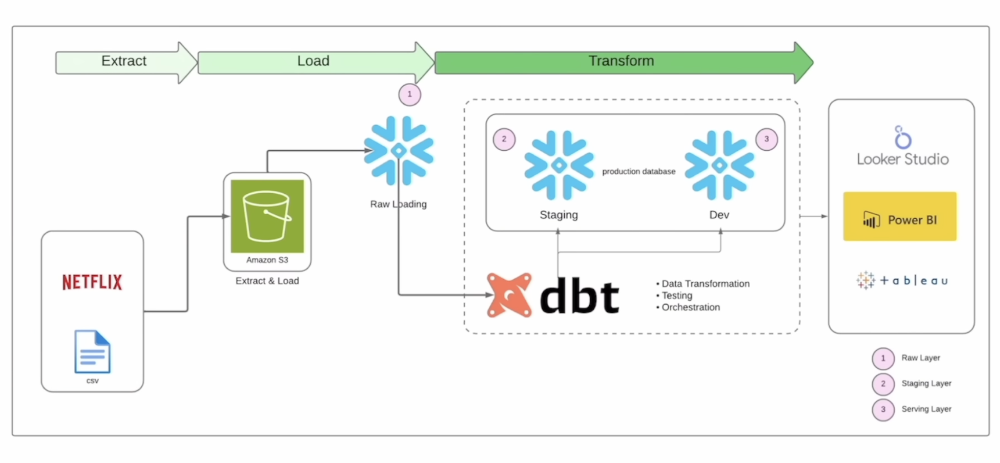

# 🎬 Netflix dbt Analytics Project

<p align="center">
  
  
  
  
  
  
</p>

End-to-end **ELT analytics pipeline** for Netflix & MovieLens data. Built with **dbt + Snowflake**, it demonstrates a modern layered transformation architecture — raw source data flows through staging, dimension, fact, and mart layers into BI-ready tables for Power BI, Tableau, and Looker Studio.

---

## 🏗️ Architecture



```
Netflix CSV / MovieLens  ──►  Amazon S3  ──►  Snowflake (Raw)  ──►  dbt  ──►  BI Tools
                                                                   Staging
                                                                   Dim / Fct
                                                                   Mart
```

| Layer | Folder | Description |
|---|---|---|
| **Staging** | `models/staging/` | Raw source models — one per source table |
| **Dimensions** | `models/dim/` | Cleaned dimension tables (movies, users, tags) |
| **Facts** | `models/fct/` | Fact tables (ratings, genome scores) |
| **Marts** | `models/mart/` | BI-ready aggregated tables |
| **Snapshots** | `snapshots/` | SCD Type 2 tracking (tags) |
| **Seeds** | `seeds/` | Static reference data (movie release dates) |

---

## 🚀 Quick Start

```bash
git clone https://github.com/atulpandey02/netflix-dbt-project.git
cd netflix-dbt-project

pip install dbt-snowflake
dbt deps
dbt seed
dbt run
dbt test
```

---

## ⚙️ Environment Variables

```bash
export SNOWFLAKE_ACCOUNT=<your_account>
export SNOWFLAKE_USER=<your_user>
export SNOWFLAKE_PASSWORD=<your_password>
export SNOWFLAKE_DATABASE=MOVIELENS
export SNOWFLAKE_WAREHOUSE=COMPUTE_WH
export SNOWFLAKE_ROLE=TRANSFORMER
```

---

## 📂 Project Structure

```
netflix-dbt-project/
├── models/
│   ├── sources.yml                      # Source definitions
│   ├── schema.yml                       # Model tests & docs
│   ├── staging/
│   │   ├── src_movies.sql
│   │   ├── src_rating.sql
│   │   ├── src_tags.sql
│   │   ├── src_links.sql
│   │   ├── src_genome_tags.sql
│   │   └── src_genome_score.sql
│   ├── dim/
│   │   ├── dim_movies.sql
│   │   ├── dim_movies_with_tags.sql
│   │   ├── dim_users.sql
│   │   └── dim_genome_tags.sql
│   ├── fct/
│   │   ├── fct_ratings.sql
│   │   ├── fct_genome_scores.sql
│   │   └── fct_genome_score.sql
│   └── mart/
│       └── mart_movie_releases.sql
├── analyses/
│   └── movie_analysis.sql               # Ad-hoc analysis queries
├── snapshots/
│   └── snap_tags.sql                    # SCD Type 2 — tags history
├── seeds/
│   └── seed_movie_release_dates.csv     # Static release date reference
├── macros/
│   └── no_nulls_in_columns.sql          # Reusable null-check macro
├── tests/
│   └── relevence_score_test.sql         # Custom relevance score test
├── dbt_project.yml
└── packages.yml
```

---

## 🧪 Testing & Data Quality

```bash
dbt test                              # run all schema + custom tests
dbt test --select fct_ratings         # test a specific model
```

- **Schema tests** — `unique`, `not_null`, `accepted_values` defined in `schema.yml`
- **Custom test** — `relevence_score_test.sql` validates genome score ranges
- **Macro** — `no_nulls_in_columns.sql` reusable null assertion across models

---

## 📸 Snapshots

`snap_tags.sql` tracks historical changes to the tags table using **SCD Type 2**, enabling point-in-time analysis of how movie tags have evolved.

```bash
dbt snapshot
```

---

## 📊 BI Connectivity

The mart and fact tables connect directly to:
- **Power BI** — Snowflake native connector
- **Looker Studio** — Snowflake partner connector
- **Tableau** — Snowflake native connector

---

## 📌 Data Sources

| Dataset | Description |
|---|---|
| [MovieLens 20M](https://grouplens.org/datasets/movielens/20m/) | Ratings, tags, genome scores from GroupLens |
| [Netflix Titles](https://www.kaggle.com/datasets/shivamb/netflix-shows) | Movies & TV shows metadata from Kaggle |

---

*Built as a reference implementation of a modern dbt ELT pipeline on Snowflake.*
